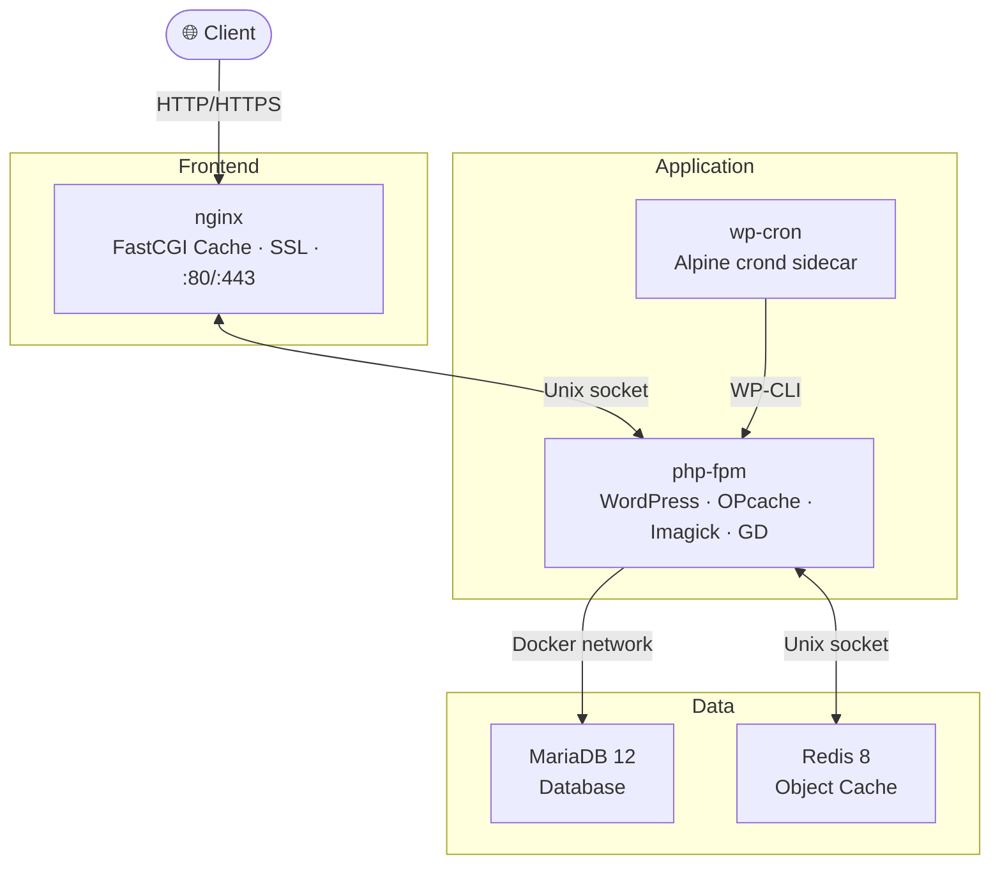

# wp-lemp-docker

[](LICENSE)
[](https://docs.docker.com/compose/)
[](https://www.php.net/)
[](https://www.php.net/)
[](https://www.php.net/)
[](https://nginx.org/)
[](https://mariadb.org/)

High-performance WordPress Docker stack using nginx, PHP-FPM, MariaDB, and Redis. All images are pre-built — zero server-side builds required.

## Features

- **Zero builds** — All images pre-built and pulled from GHCR (multi-arch amd64 + arm64)
- **FastCGI Cache** — Nginx page caching with nginx-helper (default) or WP-Rocket, Cache Enabler, WP Super Cache
- **Redis object cache** — Via Unix socket for minimal latency
- **OPcache + JIT** — Pre-tuned for production WordPress
- **WP-Cron sidecar** — Cron disabled in WordPress, handled by dedicated Alpine container
- **SSL** — acme.sh + Let's Encrypt with HTTP-01 webroot validation
- **Multisite** — Subdirectory and subdomain modes
- **PHP 8.3 / 8.4 / 8.5** — Switchable via `.env`

## Architecture



All inter-service communication uses Unix sockets through shared Docker volumes for maximum performance. No server-side builds — all images are pulled pre-built from GHCR.

## Quick Start

1. Copy environment template:
   ```bash
   cp .env.example .env
   ```

2. Edit `.env` and set your domain and secure passwords

3. Start the stack:
   ```bash
   docker compose up -d
   ```

4. Access WordPress at `http://your-domain.com`

## SSL Setup

1. Run initial setup without SSL to verify everything works

2. Obtain SSL certificate:
   ```bash
   docker exec nginx /etc/nginx/scripts/obtain-ssl.sh
   ```

3. Enable SSL in `.env`:
   ```
   SSL=1
   ```

4. Restart:
   ```bash
   docker compose restart
   ```

## Cache Modes

Set `CACHE_MODE` in `.env`:
- `fastcgi-cache` (default) — Nginx FastCGI page caching with nginx-helper
- `wp-rocket` — WP-Rocket plugin
- `cache-enabler` — Cache Enabler plugin
- `wp-super-cache` — WP Super Cache plugin
- `redis-cache` — FastCGI page cache + Redis object cache

Redis object cache is always active (via redis-cache plugin) regardless of cache mode.

## Multisite

Set `WP_MULTISITE` in `.env`:
- `no` (default) — Single site
- `subdirectory` — Multisite with subdirectories
- `subdomain` — Multisite with subdomains

## PHP Versions

Set `PHP_VERSION` in `.env`:
- `8.3`
- `8.4`
- `8.5` (default)

## Requirements

- Docker Engine 20.10+
- Docker Compose V2
- 1GB RAM minimum (2GB recommended)

## License

[MIT](LICENSE)
